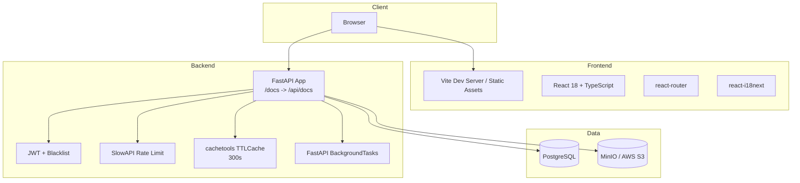
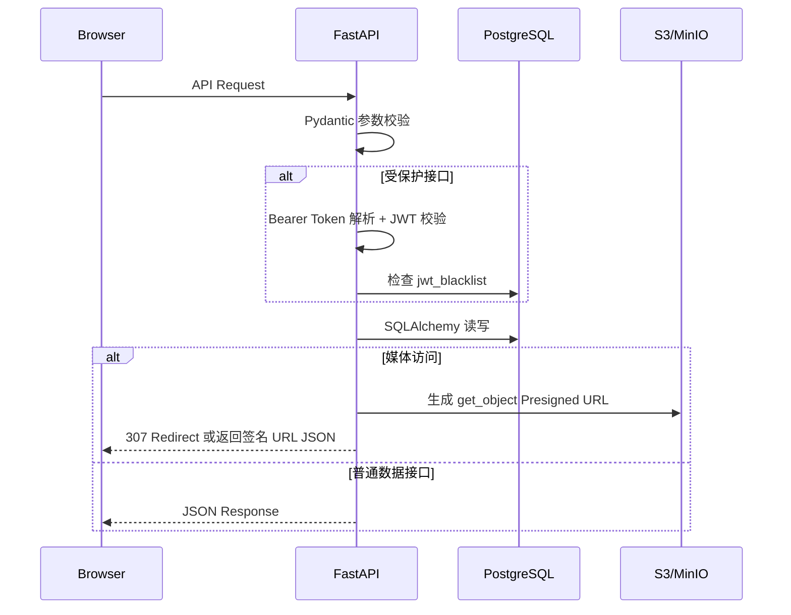
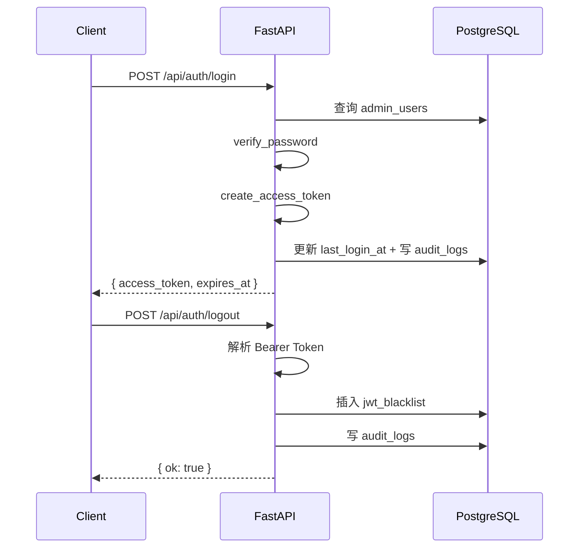
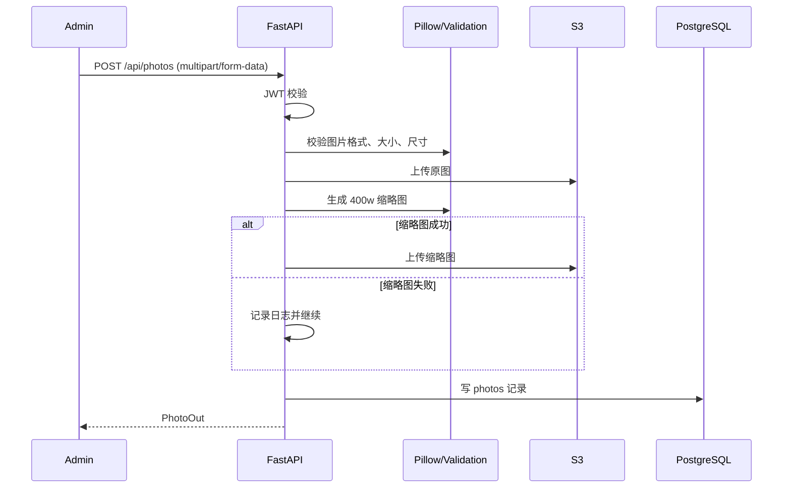
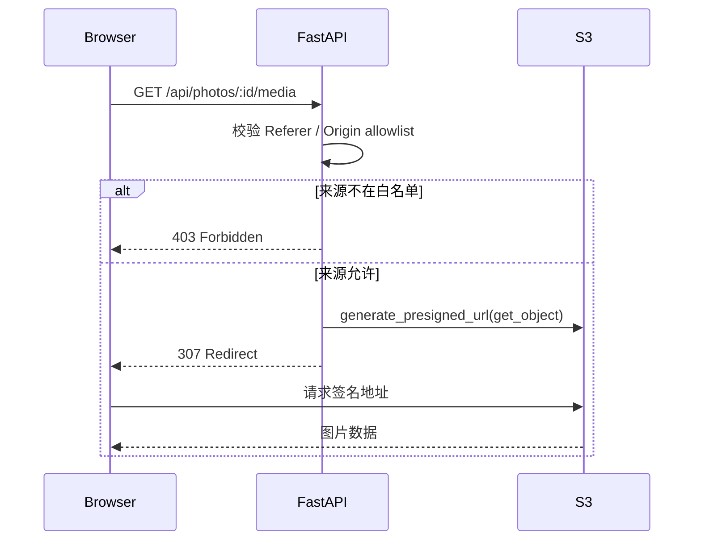
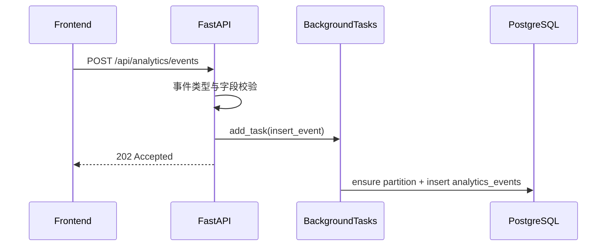

# 技术设计文档：摄影师个人官网后端系统
## Overview

本文档描述当前仓库中已经落地的摄影师官网全栈实现，并以当前代码为准对齐规格。系统由 React 18 + Vite 前端与 Python/FastAPI 后端组成，后端使用 SQLAlchemy 访问 PostgreSQL，使用 Alembic 管理迁移，使用 S3 兼容对象存储承载图片和视频文件。

**当前设计目标：**
- 前端视觉和交互尽量保持原站风格不变，仅替换数据来源为真实 API
- 后端采用 Python/FastAPI + SQLAlchemy + Alembic，而非旧版 Node.js/Fastify 方案
- 媒体文件通过 S3 兼容存储保存，公开访问经后端生成签名地址或媒体代理跳转完成
- 管理员鉴权、JWT 黑名单、审计日志、限流、访问分析均已在当前代码中实现基础闭环
- 文档明确区分“当前已实现行为”与“SubTask 9.2-9.4 仍待完成的差距”

---

## Architecture

### 系统整体架构



### 当前请求流转



### 与旧设计的关键差异

| 项目 | 旧文档 | 当前实现 |
|------|--------|----------|
| 后端语言 | Node.js / TypeScript | Python 3.12 |
| Web 框架 | Fastify | FastAPI |
| ORM / DB 访问 | `pg` + 手写 repo | SQLAlchemy ORM |
| 迁移工具 | 自定义 SQL / scripts | Alembic |
| 校验方式 | Zod | Pydantic |
| 限流 | Fastify rate-limit | SlowAPI |
| 缓存 | node-cache | `cachetools.TTLCache` |
| 异步分析写入 | 队列 / BullMQ 风格 | `BackgroundTasks` |
| 图片处理 | sharp | Pillow |
| 前端 API 组织 | 拟定 `src/app/api/*` + hooks | 实际为 `src/app/api/client.ts` + `portfolio.ts`，组件直接调用 |

---

## Components and Interfaces

### 后端项目目录结构

```text
backend/
├── app/
│   ├── main.py                    # FastAPI 应用创建、异常处理、启动初始化
│   ├── api/
│   │   ├── router.py              # /api 总路由
│   │   ├── deps.py                # DB 会话与当前管理员依赖
│   │   └── routes/
│   │       ├── auth.py            # 登录 / 登出
│   │       ├── videos.py          # 主页视频管理与播放跳转
│   │       ├── collections.py     # 合集 CRUD
│   │       ├── photos.py          # 图片 CRUD、批量操作、签名 URL、媒体跳转
│   │       ├── about.py           # About 内容读写
│   │       ├── ai_entries.py      # AI 入口 CRUD
│   │       └── analytics.py       # 埋点上报与统计查询
│   ├── core/
│   │   ├── config.py              # 环境变量与配置解析
│   │   ├── rate_limit.py          # SlowAPI limiter
│   │   └── security.py            # bcrypt_sha256 + JWT
│   ├── db/
│   │   ├── base.py                # SQLAlchemy Base
│   │   └── session.py             # engine / SessionLocal / 连接预热
│   ├── models/                    # SQLAlchemy 模型
│   ├── schemas/                   # Pydantic 输入输出模型
│   └── services/
│       ├── analytics.py           # 分区创建、时间归一化
│       ├── audit.py               # 审计日志写入
│       ├── file_validation.py     # 图片/视频格式与大小校验
│       ├── storage.py             # boto3 S3 客户端与 presign
│       └── thumbnails.py          # 400px 缩略图生成
├── migrations/
│   ├── env.py                     # Alembic 环境
│   └── versions/
│       ├── 0001_init.py
│       ├── 0002_task2_media_content.py
│       ├── 0002_analytics_task3.py
│       └── 0003_merge_task2_and_analytics_heads.py
├── alembic.ini
├── pyproject.toml
└── .env.example
```

### 前端实际接入结构

```text
src/app/
├── api/
│   ├── client.ts                  # fetch 封装、token 存取、错误提取
│   └── portfolio.ts               # 全部站点 API 调用与 DTO 映射
├── components/
│   ├── Root.tsx                   # 全局 page_view 埋点
│   ├── Home.tsx                   # 视频与精选合集 API 接入，失败回退本地内容
│   ├── Gallery.tsx                # 合集/图片 API 接入，懒加载，失败回退本地内容
│   ├── About.tsx                  # About API 接入，失败回退 i18n / 本地链接
│   ├── Apps.tsx                   # AI 入口 API 接入
│   ├── Admin.tsx                  # 管理端登录、CRUD、统计面板
│   └── LazyPhotoImage.tsx         # IntersectionObserver 懒加载图片
└── i18n/
```

### 核心依赖

| 依赖 | 当前用途 |
|------|----------|
| `fastapi` | HTTP API 框架 |
| `sqlalchemy` | ORM 与查询构建 |
| `alembic` | 数据库迁移 |
| `psycopg` | PostgreSQL 驱动 |
| `pydantic` / `pydantic-settings` | 配置与请求校验 |
| `pyjwt` | JWT 编解码 |
| `bcrypt` | 管理员密码哈希 |
| `slowapi` | 登录、分析等接口限流 |
| `boto3` / `botocore` | S3 兼容对象存储与 Presigned URL |
| `Pillow` | 图片读取、尺寸识别、缩略图生成 |
| `cachetools` | 分析查询 5 分钟缓存 |
| React 18 + TypeScript | 前端实现 |
| `react-router` | 路由 |
| `react-i18next` | 中英文切换 |
| `sonner` | 管理端和前台错误提示 |

---

## Data Models

### 数据库设计说明

当前实现使用 **整数自增主键**，并非旧文档中的 UUID 方案。数据库表由 Alembic 迁移维护，分析表仍采用按月分区的 PostgreSQL 方案。

### 1. `admin_users`

- `id`: `Integer` 主键
- `username`: 唯一管理员用户名
- `email`: 可空，唯一
- `password_hash`: bcrypt 或 `bcrypt_sha256$...` 哈希
- `last_login_at`: 最近登录时间
- `created_at` / `updated_at`: 时间戳

### 2. `jwt_blacklist`

- `id`: `Integer` 主键
- `jti`: 唯一 JWT ID
- `expires_at`: 令牌过期时间
- `created_at`: 创建时间

### 3. `home_videos`

- `id`: `Integer` 主键
- `title`: 视频标题
- `s3_key`: 对象存储 key，唯一
- `source_url`: 对象原始访问地址，仅作记录
- `mime_type`: `video/mp4` 或 `video/webm`
- `file_size`: 文件字节数
- `poster_key`: 预留海报字段，当前接口未使用
- `is_active`: 是否公开
- `sort_order`: 排序值，默认 100
- `created_at` / `updated_at`

### 4. `collections`

- `id`: `Integer` 主键
- `location_en`: 英文地点名，唯一
- `location_zh`: 中文地点名，可空
- `description_en` / `description_zh`
- `category`: 分类
- `sort_order`
- `created_at` / `updated_at`

### 5. `photos`

- `id`: `Integer` 主键
- `collection_id`: 关联 `collections.id`，级联删除
- `title_en` / `title_zh`
- `description_en` / `description_zh`
- `details_en` / `details_zh`
- `location`
- `category`
- `image_key` / `image_url`: 原图对象 key 与记录地址
- `thumb_key` / `thumb_url`: 缩略图对象 key 与记录地址，可空
- `width` / `height`
- `mime_type`
- `file_size`
- `copyright_name` / `copyright_year`
- `sort_order`
- `created_at` / `updated_at`

### 6. `about_content`

当前实现不是严格数据库约束的单行表，但接口层按“取第一条记录”方式使用。

- `id`: `Integer` 主键
- `intro_en` / `intro_zh`
- `locations_en` / `locations_zh`: JSON 数组
- `contact`: JSON 对象
- `portrait_url`
- `created_at` / `updated_at`

### 7. `ai_entries`

- `id`: `Integer` 主键
- `title_en` / `title_zh`
- `description_en` / `description_zh`
- `url`: 仅允许 `https://`
- `is_active`
- `sort_order`
- `created_at` / `updated_at`

### 8. `audit_logs`

- `id`: `Integer` 主键
- `actor_admin_id`
- `action`
- `target_type` / `target_id`
- `ip`
- `user_agent`
- `detail`: JSONB
- `created_at`

### 9. `analytics_events`（按月分区）

- 复合主键：`(id, created_at)`
- `event_type`: `page_view | button_click | photo_view`
- `page`
- `target_type`
- `target_id`
- `meta`: JSONB
- `ip_hash`: 使用 `jwt_secret` 加盐后的 SHA-256
- `referer`
- `user_agent`
- `created_at`

### 分区策略

- `0001_init` 创建父表 `analytics_events`
- 启动阶段调用 `ensure_required_analytics_partitions()`，保证当前月与未来 1 个月分区存在
- `0002_analytics_task3` 为 `target_id` 扩容并补齐约束与分区索引

---

## API 端点设计

以下均以当前 FastAPI 实现为准。

### 认证 API

| 方法 | 路径 | 描述 | 鉴权 |
|------|------|------|------|
| POST | `/api/auth/login` | 管理员登录，返回访问令牌 | 无 |
| POST | `/api/auth/logout` | 将当前 JWT 拉黑 | 需要 JWT |

**`POST /api/auth/login` 请求体**

```json
{
  "username": "admin",
  "password": "secret"
}
```

**成功响应**

```json
{
  "access_token": "eyJhbGci...",
  "expires_at": "2026-05-19T12:00:00+00:00"
}
```

**当前实现要点：**
- 登录成功后更新 `last_login_at`
- 写入 `auth.login` 审计日志
- 使用 JWT `sub/jti/type/iat/exp`
- JWT 默认过期时间由 `jwt_exp_hours` 控制，默认 24 小时

### 视频 API

| 方法 | 路径 | 描述 | 鉴权 |
|------|------|------|------|
| GET | `/api/videos` | 获取公开视频列表 | 无 |
| GET | `/api/videos/all` | 获取全部视频 | 需要 JWT |
| GET | `/api/videos/{id}/play` | 生成签名地址并 307 跳转播放 | 无 |
| POST | `/api/videos` | 上传并创建视频 | 需要 JWT |
| PUT | `/api/videos/{id}` | 更新标题/排序/状态 | 需要 JWT |
| PATCH | `/api/videos/{id}/status` | 单独切换启用状态 | 需要 JWT |
| DELETE | `/api/videos/{id}` | 删除视频记录与对象存储文件 | 需要 JWT |

**当前响应特点：**
- `GET /api/videos` 返回数组，不包 `data`
- `url` 字段是站内播放地址 `/api/videos/{id}/play`，不是对象存储直链

### 视频上传格式支持补充

为满足“上传视频格式不能只停留在单一格式”的新增需求，视频上传链路需要从校验、后台选择器提示和存储元数据三个层面统一扩展对主流格式的支持。

**支持范围**
- 后端视频上传校验至少支持 `MP4`、`M4V`、`MOV`、`WebM`
- 对于容器兼容的 `MP4 / M4V / MOV`，后端需要基于声明 MIME、文件头特征或可接受的兼容映射做统一判断
- 返回给前端的 `mime_type` 继续以实际可识别的媒体类型为准，不要求额外引入转码流程

**后台交互**
- `Admin` 视频上传区的文件选择器 `accept` 需要与后端支持范围保持一致
- 上传区说明文案应明确后台当前支持的主流视频格式，避免管理员误以为仅支持单一格式
- 若管理员选择不支持的格式，前端可先给出基础提示，但以后端校验结果为最终准则

**实现边界**
- 本次补充仅要求支持更多主流上传格式，不要求新增服务端转码、封面抽帧或编码标准化
- 若某些格式在浏览器播放兼容性上存在差异，当前阶段以后端可上传、可存储、可按现有链路返回为目标

### MOV 首页播放问题诊断补充

当前实现允许 `MOV` 文件上传，并在数据库中保留其声明 MIME，例如 `video/quicktime`。但首页 `Home.tsx` 的 `<video>` 播放链路会直接使用后端返回的 `mime_type` 作为 `<source type>`，这会让浏览器按 `video/quicktime` 解析资源。

**已识别风险**
- `MOV` 容器在 Chromium 系浏览器中的支持并不稳定，是否可播取决于容器和编码组合
- 当前系统只做“上传格式放行”，没有做“首页播放兼容化处理”
- 因此会出现“后台已上传且已启用、首页公开视频接口也已返回，但首页实际不播放”的静默失败

**针对该问题的推荐方案**
- 推荐方案：在视频上传后对 `MOV / M4V` 等兼容性不稳定格式执行转码或规范化处理，产出首页分发使用的 `MP4(H.264/AAC)` 版本，并由首页播放链路优先使用该兼容版本
- 备选方案：若暂不引入转码能力，则后台在上传或启用此类视频时明确提示“可存储但不保证首页直接播放”，并在首页对播放失败给出可见降级反馈

**为什么推荐转码**
- 能同时满足“后台支持上传主流格式”和“首页稳定播放”两个目标
- 不依赖用户事先理解浏览器对 `MOV` 的实际支持差异
- 对首页首屏视频体验最稳定，也更符合当前官网场景

### 合集 API

| 方法 | 路径 | 描述 | 鉴权 |
|------|------|------|------|
| GET | `/api/collections` | 获取合集列表与 `photo_count` | 无 |
| GET | `/api/collections/{id}` | 获取单个合集详情 | 无 |
| POST | `/api/collections` | 创建合集 | 需要 JWT |
| PUT | `/api/collections/{id}` | 更新合集 | 需要 JWT |
| DELETE | `/api/collections/{id}` | 删除合集及其图片 | 需要 JWT |

**当前实现说明：**
- 删除合集时先删库，再尝试清理 S3 对象；对象删除失败只记日志，不回滚数据库
- `location_en` 唯一冲突返回 409

### 图片 API

| 方法 | 路径 | 描述 | 鉴权 |
|------|------|------|------|
| GET | `/api/photos` | 列表查询，支持过滤和分页 | 无 |
| GET | `/api/photos/{id}` | 图片详情 | 无 |
| GET | `/api/photos/{id}/presigned` | 返回原图/缩略图签名 URL JSON | 无 |
| GET | `/api/photos/{id}/media` | 检查 Referer 后 307 跳转到原图签名地址 | 无 |
| POST | `/api/photos` | 上传图片并创建记录 | 需要 JWT |
| PUT | `/api/photos/{id}` | 更新图片元数据 | 需要 JWT |
| DELETE | `/api/photos/{id}` | 删除图片 | 需要 JWT |
| POST | `/api/photos/batch-delete` | 批量删除，最多 100 条 | 需要 JWT |
| PATCH | `/api/photos/batch-update` | 批量改地点/分类，最多 100 条 | 需要 JWT |

**`GET /api/photos` 查询参数**

```text
?location=Switzerland
&category=Landscape
&collection_id=1
&page=1
&page_size=20
```

**`GET /api/photos/{id}` / 列表项返回字段要点**

```json
{
  "id": 1,
  "collection_id": 1,
  "title_en": "Morning",
  "title_zh": "清晨",
  "description_en": "...",
  "description_zh": "...",
  "details_en": "...",
  "details_zh": "...",
  "location": "Switzerland",
  "category": "Landscape",
  "image_url": "/api/photos/1/media",
  "thumb_url": "/api/photos/1/media?variant=thumb",
  "mime_type": "image/jpeg",
  "file_size": 102400,
  "width": 3000,
  "height": 2000,
  "sort_order": 100,
  "copyright": {
    "photographer": "Johnie Photography",
    "year": 2026
  },
  "created_at": "2026-05-18T12:00:00+00:00",
  "updated_at": "2026-05-18T12:00:00+00:00"
}
```

**`GET /api/photos/{id}/presigned` 返回字段**

```json
{
  "presigned_url": "https://...",
  "thumb_presigned_url": "https://...",
  "expires_in": 3600,
  "expires_at": "2026-05-18T13:00:00+00:00",
  "copyright": {
    "photographer": "Johnie Photography",
    "year": 2026
  }
}
```

**当前实现说明：**
- 上传时校验 MIME、大小、图片可读性，并用 Pillow 生成 400px 宽缩略图
- 若未显式传 `location`/`category`，创建时默认继承所属合集
- 当前前台 Gallery 实际使用 `image_url` / `thumb_url` 也就是 `/media` 路径，不是先调用 `/presigned`

### About API

| 方法 | 路径 | 描述 | 鉴权 |
|------|------|------|------|
| GET | `/api/about` | 获取 About 内容 | 无 |
| PUT | `/api/about` | 更新 About 内容 | 需要 JWT |

**查询参数：**

```text
?lang=en
?lang=zh
```

**当前实现说明：**
- `GET` 会按 `lang` 返回聚合后的 `intro` 与 `locations`，同时保留双语原字段
- 无记录时返回空对象结构，不报 404
- `PUT` 当前响应固定序列化为英文聚合视图，但仍包含 `intro_en` / `intro_zh` 等全量字段

### AI 入口 API

| 方法 | 路径 | 描述 | 鉴权 |
|------|------|------|------|
| GET | `/api/ai-entries` | 获取启用项 | 无 |
| GET | `/api/ai-entries/all` | 获取全部项 | 需要 JWT |
| POST | `/api/ai-entries` | 创建 AI 入口 | 需要 JWT |
| PUT | `/api/ai-entries/{id}` | 更新 AI 入口 | 需要 JWT |
| DELETE | `/api/ai-entries/{id}` | 删除 AI 入口 | 需要 JWT |

### 分析 API

| 方法 | 路径 | 描述 | 鉴权 |
|------|------|------|------|
| POST | `/api/analytics/events` | 接收埋点，后台异步入库，返回 202 | 无 |
| GET | `/api/analytics/pageviews` | 页面 PV 统计 | 需要 JWT |
| GET | `/api/analytics/top-photos` | 热门图片统计 | 需要 JWT |
| GET | `/api/analytics/button-clicks` | 按钮点击统计 | 需要 JWT |

**埋点请求体兼容字段：**

```json
{
  "eventType": "button_click",
  "page": "/gallery",
  "targetType": "gallery-filter",
  "targetId": "category:Landscape",
  "timestamp": "2026-05-18T12:00:00Z",
  "meta": {}
}
```

**当前实现说明：**
- 通过 Pydantic alias 同时兼容 `eventType` / `event_type`
- `page_view` 未传 `targetId` 时自动回填 `page`
- 统计结果使用 `TTLCache(ttl=300)` 做 5 分钟缓存

---

## 关键流程设计

### 流程 1：管理员登录与登出



### 流程 2：图片上传



### 流程 3：图片访问



### 流程 4：分析事件异步持久化



---

## 前端改造现状

### 实际接入方式

当前前端并未采用旧文档中预留的 `api/*.ts + hooks/*` 分层方案，而是使用更轻量的结构：

- `src/app/api/client.ts`：封装 `fetch`、管理员 token、错误解析
- `src/app/api/portfolio.ts`：集中定义全部 API 请求与前后端字段映射
- 页面组件直接在 `useEffect` 或事件处理函数中调用这些 API

### 各页面当前行为

**`Root.tsx`**
- 路由变化时调用 `trackEvent({ eventType: 'page_view', ... })`

**`Home.tsx`**
- 调用 `fetchPublicVideos()` 获取视频列表
- 调用 `fetchCollections()` + `fetchPhotos()` 组合精选合集封面
- API 失败时分别回退到本地视频和静态精选内容

### 首页三视频轮播设计补充

为满足“首页支持 3 个视频轮播”的新增需求，首页顶部首屏继续保持现有全屏视频背景和文案布局不变，但视频层改为最多使用 3 条启用视频进行自动轮播。

**后端返回策略**
- `GET /api/videos` 继续作为首页公开视频数据源
- 接口仅返回状态为启用的首页视频，并按 `sort_order asc, created_at asc` 排序
- 首页轮播场景下，接口最多返回前 3 条启用视频
- 管理后台 `GET /api/videos/all` 仍返回全部视频，供管理员完整管理

**前端轮播策略**
- `Home.tsx` 从公开视频接口读取最多 3 条视频
- 当返回 3 条或 2 条视频时，首页在同一首屏区域内按顺序自动轮播
- 当返回 1 条视频时，首页保持现有单视频展示，不额外引入轮播控件
- 当未返回视频时，首页继续沿用现有回退视频或背景空态

**交互与视觉约束**
- 不新增破坏当前设计语言的显式分页器、缩略图条或大体量控制条
- 轮播切换优先采用淡入淡出或同层级无突兀的过渡方式，保持日式留白和沉浸式视觉
- 顶部导航显隐、标题文案、底部悬浮入口和精选内容逻辑保持不变
- 视频层仍需保留现有右键禁用、保存快捷键拦截和 `playsInline` 等限制

**后台同步说明**
- 管理后台的视频管理区继续复用现有 CRUD 交互，不新增复杂配置表单
- 后台文案需明确说明：首页将按排序权重选取前 3 条启用视频进行轮播
- 管理员通过已有排序和启用状态即可控制首页轮播的 3 条视频及其先后顺序

**`Gallery.tsx`**
- 调用 `fetchCollections()` 与 `fetchPhotos()` 构建合集页
- 使用 `LazyPhotoImage` + `IntersectionObserver` 做懒加载
- 当前 `loadPhotoSrc()` 直接返回 `thumbUrl || imageUrl`，也就是 `/api/photos/{id}/media` 路径
- API 失败时回退到本地 `photoCollections`

**`About.tsx`**
- 调用 `fetchAbout(i18n.language)` 获取介绍、地点和联系方式
- API 失败时回退到 i18n 文案与本地联系链接
- 联系表单当前只做本地提示，不接消息投递后端

### Business Collaboration 留言闭环设计补充

当前 `About.tsx` 中的 `Business Collaboration` 区域虽然有姓名、邮箱、公司和留言表单，但提交动作仍是前端本地 toast，占位文案为 “Message drafted locally. Direct messaging API is not configured.”。这意味着当前并没有真正的“访客留言 -> 你收到通知 -> 后台可查看 -> 可验收”的闭环。

结合本次确认的偏好，系统采用以下方案：
- 主通知方式：邮件通知到站点拥有者邮箱
- 留档方式：后台收件箱持久化存储每条合作留言
- 访客确认：提交成功后自动给访客邮箱发送一封确认邮件副本

**前台交互**
- 访客在 `About` 页面继续使用现有的 `Business Collaboration` 表单，不改变整体布局和视觉风格
- 表单字段保持轻量：`name`、`email`、`company`、`message`
- 提交按钮在发送中显示 loading / disabled 状态，避免重复提交
- 提交成功后显示明确成功提示，例如“已收到您的合作需求，我们已发送确认邮件到您的邮箱”
- 提交失败时显示明确失败原因，例如“留言已保存但邮件通知失败”或“留言提交失败，请稍后再试”

**后端设计**
- 新增合作留言实体，例如 `business_inquiries`
- 核心字段至少包括：
  - `id`
  - `name`
  - `email`
  - `company`
  - `message`
  - `source_page`，默认可记录为 `/about`
  - `status`，例如 `new / in_progress / resolved`
  - `owner_notification_status`，例如 `pending / sent / failed`
  - `visitor_receipt_status`，例如 `pending / sent / failed`
  - `created_at`、`updated_at`
- 新增公开提交接口用于访客提交留言
- 新增管理接口用于后台列表、详情和状态更新

**邮件通知设计**
- 系统需要配置 SMTP 或等效邮件发送能力
- 当留言入库成功后，后端先尝试发送站点拥有者通知邮件
- 再向访客发送确认邮件副本
- 邮件失败不应回滚已入库留言，但必须记录发送结果，供后台查看

**后台交互设计**
- `Admin.tsx` 中新增明确的 `Inquiries`、`Leads` 或 `Business` 管理入口
- 列表视图展示最近留言、访客邮箱、公司、提交时间、处理状态、邮件发送状态
- 详情视图展示完整留言正文与邮件发送结果
- 管理员可以将留言标记为 `待跟进 / 处理中 / 已处理`

**验收方式设计**
- 验收 1：访客在 About 页提交表单后，数据库里能看到新留言记录
- 验收 2：站点拥有者邮箱能收到一封新留言通知
- 验收 3：访客邮箱能收到确认邮件副本
- 验收 4：管理员在后台能看到该条留言，并修改处理状态
- 验收 5：当邮件服务异常时，前台与后台都能体现“留言已保存但通知失败”的状态，而不是静默成功

**`Apps.tsx`**
- 调用 `fetchAiEntries(i18n.language)` 获取已发布 AI 入口
- 失败时显示错误提示，不回退本地内容

**`Admin.tsx`**
- 登录后加载视频、合集、图片、About、AI 入口和统计数据
- 管理端真实接入视频/合集/图片/AI 入口 CRUD、About 更新、分析统计接口
- 使用 `FormData` 上传视频和图片

### 管理后台 About 编辑入口设计补充

为满足“后台中需要明确可见的 About 编辑设计和入口”的新增需求，`Admin.tsx` 需要在现有视觉体系内补充一个清晰、独立、可回显的 About 管理区，而不是将 About 更新能力隐藏在其他内容编辑流程中。

**入口位置**
- 在后台现有主导航、分段切换器或内容管理列表中新增明确命名的 `About` 入口
- `About` 入口与 `Videos`、`Collections`、`Photos`、`AI Entries` 等现有管理分区处于同一层级
- 入口文案直接使用 `About` 或 `About 内容`，不使用仅图标、缩写或隐含交互

**编辑区结构**
- 进入 `About` 分区后，展示一个独立表单卡片或独立编辑面板
- 表单字段至少包含：
  - `intro_zh`：中文个人介绍，多行文本
  - `intro_en`：英文个人介绍，多行文本
  - `locations_zh`：中文地点信息，可采用多行文本或一行一个地点的编辑方式
  - `locations_en`：英文地点信息，可采用多行文本或一行一个地点的编辑方式
  - `contact`：联系方式字段，至少支持用户当前站点使用的邮箱、社媒链接或联系文本
- 表单底部提供独立保存按钮，按钮语义明确，如 `保存 About` 或 `保存更改`

**数据加载与回显**
- 管理员登录成功后，Admin 初始化流程继续调用 `GET /api/about`
- 当管理员切换到 `About` 分区时，表单默认回显最近一次从后端获取的 About 内容
- 刷新页面后仍需重新请求后端数据，不依赖仅保存在组件内存中的临时状态
- 若接口返回空对象、缺少 `intro`、`locations` 或 `contact` 字段，前端应将表单初始化为空字符串、空列表文本或空联系方式对象，保证界面仍可编辑

**保存交互**
- 管理员点击保存按钮后，前端以独立表单提交流程调用 `PUT /api/about`
- 保存中按钮进入禁用或 loading 状态，避免重复提交
- 保存成功后展示明确成功反馈，例如 toast、内联成功提示或按钮状态恢复后的成功消息
- 保存失败后展示明确错误提示，并保留用户当前编辑内容，不得误提示“已保存”

**视觉约束**
- 新增 `About` 入口与编辑区必须复用后台现有的排版、间距、边框、输入框和按钮风格
- 不新增与当前站点明显冲突的重型富文本编辑器、双栏复杂控制台布局或独立主题皮肤
- 若后台使用分区切换视图，则 About 表单保持与其他内容管理区一致的卡片宽度和留白节奏

**实现边界**
- 本次补充聚焦“后台显式入口 + 结构化表单 + 保存反馈 + 回显/空态”
- 不要求在本次改动中新增头像上传、拖拽排序地点、富文本排版或草稿版本管理

---

## 安全与正确性约束

### 当前已实现约束

- JWT 登录态依赖 `Authorization: Bearer <token>`
- 登出会把 `jti` 写入 `jwt_blacklist`
- 登录接口与分析上报接口已启用限流
- 图片 `/media` 路径已做 Referer / Origin allowlist 校验
- 图片与视频上传都做格式、大小和基本内容校验
- 分析事件对 `event_type` 做白名单限制
- AI 入口 URL 必须是 `https://`
- 删除媒体数据库记录后会尽力清理 S3 对象，失败仅记日志

### 当前仍存在的规格差距

这些差距与 `tasks.md` 的后续子任务一致，保留在文档中明确标注：

1. **SubTask 9.2**
- 图片媒体路径对非白名单来源返回 `403` 已实现
- 全站生产环境 HTTPS 重定向尚未在 FastAPI/Nginx 配置层实现，仍待补齐

2. **SubTask 9.3**
- `/api/photos/{id}/presigned` 已实现
- 但 Gallery 当前并未先请求 presigned URL 再渲染，而是直接使用 `/media` 路径；这与原始安全设计目标仍有差距

3. **SubTask 9.4**
- 审计日志写入已实现
- 90 天保留策略尚未实现
- Home / Gallery 虽已大量接入 API，但失败回退和局部本地内容依赖仍存在

---

## Error Handling

### 当前错误返回风格

当前实现并非统一的 `ErrorResponse` 结构，而是以 FastAPI 默认风格为主，并在部分场景返回字符串 `detail`：

```json
{ "detail": "Invalid credentials" }
```

或校验错误数组：

```json
{
  "detail": [
    {
      "loc": ["body", "field"],
      "msg": "Field required",
      "type": "missing"
    }
  ]
}
```

### 常见状态码

| 状态码 | 场景 |
|--------|------|
| 200 | 查询、更新成功 |
| 202 | 分析事件已接收，后台异步入库 |
| 204 | 删除成功 |
| 400 | 参数错误、非法范围、空上传、无效集合 ID |
| 401 | JWT 缺失、无效、过期、已拉黑 |
| 403 | 图片媒体来源不在 allowlist |
| 404 | 资源不存在 |
| 409 | `location_en` 重复 |
| 422 | Magic bytes 与声明 MIME 不一致 |
| 429 | 触发限流 |
| 500 | 数据库写入/事务失败 |
| 502 | S3 上传失败 |

---

## Testing and Verification

### 当前可验证范围

- Alembic 迁移可用于初始化和演进数据库结构
- FastAPI 启动时会检查数据库连接、预热连接池、确保分析分区存在
- 前端通过构建与运行时交互验证 API 接入结果
- 管理端提供人工回归入口，可直接验证登录、CRUD、上传与统计查询

### 当前文档结论

本设计文档已按仓库现状完成对齐，明确反映以下事实：

- 当前正式技术栈是 **Python/FastAPI + SQLAlchemy + Alembic**
- 前端 API 接入结构是 **`client.ts` + `portfolio.ts` + 组件直接调用**
- 图片访问当前主要走 **`/media` 跳转链路**，`/presigned` 能力虽已存在，但前台尚未按目标方案全面启用
- 仍未完成的规范闭环已在文档中保留并对应 `SubTask 9.2-9.4`
